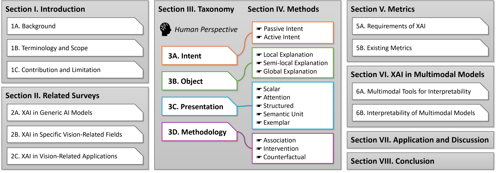

# A Survey on Interpretability in Visual Recognition

Welcome to our curated repository showcasing significant works in the field of interpretable visual recognition. This collection serves as a companion to our survey paper, **A Survey on Interpretability in Visual Recognition**, providing insights into the evolving landscape of interpretability in this dynamic domain. We welcome contributions from the community to expand and update this repository. If you have a project or paper that you believe should be included, feel free to open an issue or submit a pull request.



## Catalogue

- [A Survey on Interpretability in Visual Recognition](#a-survey-on-interpretability-in-visual-recognition)
  - [Catalogue](#catalogue)
  - [Related Survey](#related-survey)
  - [Badge Introduction](#badge-introduction)
  - [Paper List](#paper-list)
  - [Metrics and Toolkits](#metrics-and-toolkits)
  - [Citation](#citation)

## Related Survey

We offer a selection of survey papers pertinent to this research. For more information, please visit [https://vipl-vsu.github.io/xai-recognition/](https://vipl-vsu.github.io/xai-recognition/).

## Badge Introduction

The table below introduces various badges used to categorize papers in terms of the four key dimensions of XAI recognition methods: Intent, Object, Presentation, and Methodology. The badges help to efficiently tag and identify research papers based on their interpretability approaches.

| Badge | Description |
| :--- | :--- |
|         | **Intent** is *passive*. Methods that explain already trained models by revealing their recognition process. |
|          | **Intent** is *active*. Methods that integrate interpretability during model construction, making the process inherently interpretable. |
|           | **Object** is *local*. Explanation focused on individual samples, such as diagnostic suggestions for each patient. |
|       | **Object** is *semilocal*. Explanation that highlights common characteristics within a class of samples. |
|          | **Object** is *global*. Explanation of the entire model's decision rules, often category-independent. |
|          | **Presentation** is *scalar*. Explanation presented in quantitative forms, such as numerical scores. |
|       | **Presentation** is *attention*. Used to highlight important features or regions contributing to a decision. |
|       | **Presentation** is *structured*. Explanation involving structured representations such as graphs. |
|        | **Presentation** is *semantic unit*. Explanation decomposed into human-understandable semantic concepts. |
|        | **Presentation** is *exemplar*. Explanation through examples that illustrate specific model behaviors. |
|     | **Methodology** is *association*. Methods that model correlations to show the relationships and patterns between inputs and outputs. |
|    | **Methodology** is *intervention*. Methods predicting outcomes after making active changes to the model or its inputs. |
|  | **Methodology** is *conterfactual*. Simulates alternative scenarios by perturbing inputs to explore the potential outcomes that could arise under different conditions. |

## Paper List

- **Interpretable Object Recognition by Semantic Prototype Analysis**. *WACV 2024*. [Paper](https://openaccess.thecvf.com/content/WACV2024/html/Wan_Interpretable_Object_Recognition_by_Semantic_Prototype_Analysis_WACV_2024_paper.html) [Code](https://github.com/WanQiyang/SPANet)  
        

## Metrics and Toolkits

- **Quantus: An Explainable AI Toolkit for Responsible Evaluation of Neural Network Explanations and Beyond**. *JMLR 2023.* [Paper](https://www.jmlr.org/papers/v24/22-0142.html) [Code](https://github.com/understandable-machine-intelligence-lab/Quantus)

## Citation

```
@article{wan2025survey,
  title={A Survey on Interpretability in Visual Recognition},
  author={Wan, Qiyang and Gao, Chengzhi and Wang, Ruiping and Chen, Xilin},
  journal={arXiv preprint arXiv:2507.11099},
  year={2025}
}
```
